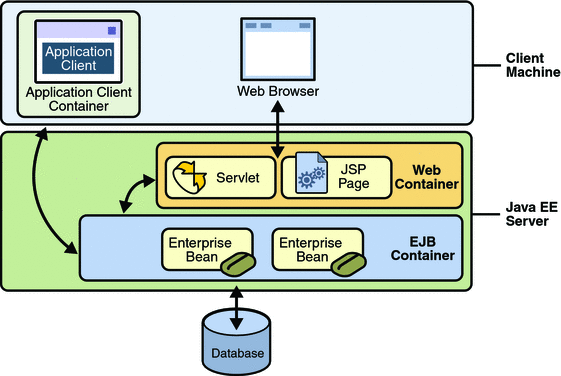

# Java
- The Java technology is both a **programming language** and **a platform**
- Java programming language
    - Is Object-oriented
    - Has C-like syntax
    - Portable across Operating systems
- Java platform
    - Is a particular environment where Java applications are run
    - Four platforms: 
        - **Java SE (Standard Edition)** - **Core platform and libraries**, defines basic types to high-level classes, JVM, JDK
        - **Java ME (Micro Edition)** - Subset of SE **for mobile devices**, small-footprint JVM, **useful for IoT (Internet of Things)**
        - **Java FX (eff-ects)** - For creating **Rich Internet Applications (RIA**), has User-interface API, has hardware accelerated graphics for high performance clients
        - **Java EE (Enterprise Edition)** - **extends SE** providing an API and runtime environment for developing and running enterprise software - networking, web-services, scalable, reliable, secure application development. Has API's to handle transactions, persistence, messaging, etc. thus allowing developers to focus on business requirements. 
    - All platforms consists of `Java Virtual Machine (JVM)` and a set of API's
    - The JVM is a program for a particular operating system and hardware that runs Java applications
    - API is a base set of software components which helps create your own app
- Java platforms comes with JVM, development tools, deployment and monitoring tools - called `Java Development Toolkit (JDK)`
- Java SE, ME, and FX applications are often clients of Java EE applications
- Enterprise applications are applications which are multi-tiered, scalable, reliable and secure - Java EE is used to create such applications. 

## Java EE 

## Server, Containers, and Components

- `Java EE server`, the runtime provides underlying services in the form of `container` for every component type
- `Containers` are the interface between a `component` and the low-level platform specific functionality that the component needs. 

  
Credits: https://docs.oracle.com/javaee/5/tutorial/doc/bnabo.html

- **Java EE server**: The runtime portion of a Java EE product. A Java EE server provides EJB and web containers.
- **Enterprise JavaBeans (EJB) container**: Manages the execution of enterprise beans for Java EE applications. Enterprise beans and their container run on the Java EE server.
- **Web container**: Manages the execution of JSP page and servlet components for Java EE applications. Web components and their container run on the Java EE server.
- **Application client container**: Manages the execution of application client components. Application clients and their container run on the client.
- **Applet container**: Manages the execution of applets. Consists of a web browser and Java Plug-in running on the client together.

### Java EE Programming model
- Business logic is organized into reusable `components`
- Convention over Configuration - Container takes default decisions

### References
- [Java EE Containers](https://docs.oracle.com/javaee/5/tutorial/doc/bnabo.html)