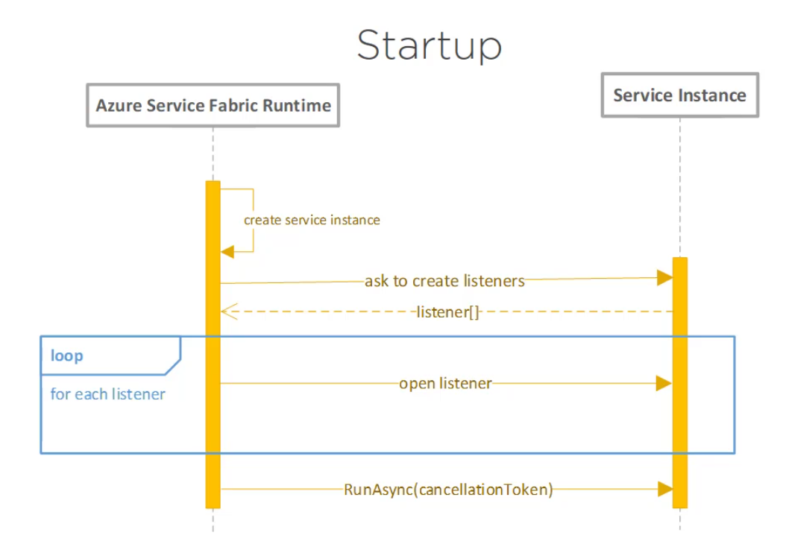
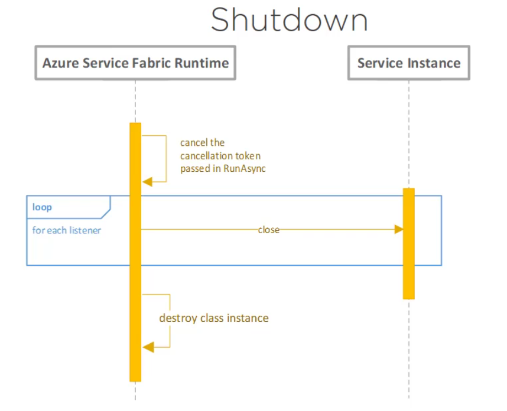

# Azure Service Fabric - Basic concepts

- Is Microsoft's **container orchestrator** for deploying microservices across a cluster of machines.
- Azure Service Fabric is a **distributed systems platform**
  - for deploying, and managing scalable and reliable microservices and containers.
- These microservices run on a shared pool of machines, known as **cluster**
- Service fabric is a **microservices platform** that gives every microservice (or container) a *unique name* that can either be *stateless or stateful*.
- It **hosts microservices inside containers** that are deployed and activated across the **Service Fabric Cluster**
- Apps build on Azure Service Fabric:
  - Skype for Business
  - Azure SQL Database
  - Cortana
  - Microsoft Power BI
- Idea is to ease out the **infrastructure problems** and focus on making the microservice app **scalable, reliable, and manageable**

## What are the current options for building Microservice applications on Azure?

### Azure Container Services
- Microsoft's implementation of open-source container technologies based on `docker`
- Helps automate the running of containers in Azure cloud  
- Docker is a container technology alone, but there are more to it - like managing containers in terms of deployment, scaling, healing, configuration, storage, networking, etc. which makes the application useful.
- This leads us to the need of **container orchestrator**
    - Popular Container Orchestrators
        - Docker Swarm
        - DC/OS
        - Kubernetes
- Azure supports all of these

### Azure Service Fabric
- Is all about `Microservices`
- Helps create scalable applications working on hundreds of machines in a cluster
- Helps solve:
    - Communication between microservices
    - Service discovery
    - Telemetry
    - Provision and upgrade
    - Testing microservices locally
    - Managing downtimes
    - Scaling in and out
- It is another step forward in `Microservice design`

### Azure Functions
- It is another option to create `Microservices`
- Like a regular C# function, we can create a function which will be triggered upon an event
- This function in turn becomes a micro-micro service
- We don't need to provision a server for this solution - and hence it is a `serverless technology`
- It can be thought of as an event-driven observer pattern

## Stateful and Stateless microservices
- Stateless microservice do not maintain a mutable state outside a request and its response from the service. Example of such services:
  - Protocol gateways
  - Web proxies
  - Azure cloud services worker roles
- Stateful microservices maintain a mutable state beyond the request and its response. For example,
   - user accounts
   - databases
   - devices
   - shopping carts
   - Queues

## Programming Models in Azure Service Fabric
- Three main approaches to create a Microservice in Service Fabric
    - **Reliable Services**
        - Similar to a windows service or Linux daemon application
        - Think of them as a Console application and we are not required to use Service Fabric tools
        - There are two types - **Stateless** and **Stateful**
        - Stateless are more of like console applications in look and behavior
        - Stateful have their own transactional replicated storage
    - **Reliable Actors**
        - Implementation of [`Virtual Actor pattern`](https://www.microsoft.com/en-us/research/project/orleans-virtual-actors/?from=http%3A%2F%2Fresearch.microsoft.com%2Fen-us%2Fprojects%2Forleans%2F)
        - Built on top of **Stateful reliable services**
    - **Guest Executables**
        - Let's any application written in any languages to work with Service Fabric as a service without modifying them
        - Treated as **stateless services**
        - Useful for deploying an existing executable to Service Fabric

## Reliable Services
- **Is a programming model** in Azure Service Fabric
- Two types of **reliable services** are: **stateful reliable service** and **stateless reliable service**
- Use **Stateless service** if your microservice has no persistent state or want to manage the state in a external store such as SQL Database or Azure DocumentDB.
- Use **Stateful service** if you want to manage your persistent state within the service itself using **reliable collections framework**. *State can be partitioned for scale and replicated across the cluster for reliability*.
- The Reliable services programming model helps make the application:
  - **Reliable**: Service stays up even in unreliable situation or network issues. For *stateful service*, the state is preserved.
  - **Available**: Your service is *reachable and responsive*. Service fabric maintains your desired number of running copies.
  - **Scalable**: No tight coupling to hardware service instances can be increased / decreased based on needs.
  - **Consistent**: Information stored in Service fabric is consistent.
- **Web API is a stateless service** in Azure Service fabric terminology as it acts as a **facade** to the front-end system in most cases ??
- In Azure Service fabric terminology, **any service which runs on the background is a reliable service**
- Why write a reliable service?
  - if our application is a microservice
  - it has scaling, health monitoring, service discovery (to discover other services) concerns to be taken care of
  - we can use the Azure Service Fabric's built-in **Pluggable Communication Model** whether it is HTTP, TCP, Web sockets, etc.
  - access to **reliable storage**. See [reliable collections](https://docs.microsoft.com/en-us/azure/service-fabric/service-fabric-reliable-services-reliable-collections)  

        

### Creating a Service Fabric application (QuotesCollector)
- To create a Service fabric application (make sure you have Azure Service fabric SDK installed already) - Open VS 2017, File -> New Project -> Visual C# -> Cloud -> Service Fabric Application
- The application collects Quotes from various sources - movies, books, persons etc.; The operations - add, delete, update, edit quotes are done via an API, and the information is persisted in a storage.
  - QuotesCollector.QuotesCatalog - A reliable service application
- Create project - `QuotesCollector` and add a `Stateful service` project named - `QuotesCollector.QuotesCatalog`
- Once the solution is created, we can see two types of projects:
  - `QuotesCollector` - a **service fabric project which describes the whole application in the cluster** - it contains description of on **how to deploy the application**, **application parameters**, **services involved**.
  - `QuotesCollector.QuotesCatalog` - is **an implementation of a service auto-generated for us to start with**
  - It is a console application and the main method does the following:
    - **Register the service** with the runtime by giving a **name for the service type** and tells Service fabric runtime **how to create it** when required:  
    ```
    ServiceRuntime.RegisterServiceAsync("QuotesCollector.QuotesCatalogType",
                      context => new QuotesCatalog(context)).GetAwaiter().GetResult();
    ```
    Note: This name is in `ServiceManifest.xml` configuration and must match the string used in RegisterServiceType call in Program.cs.
    - It then **logs the information** through a helper class `ServiceEventSource`  
    ```
    ServiceEventSource.Current.ServiceTypeRegistered(Process.GetCurrentProcess().Id, typeof(QuotesCatalog).Name);
    ```
    - It then make the **process thread to sleep** so that it doesn't terminate.
  - The entry point class is the `class QuotesCatalog : StatefulService` which is a implementation of `StatefulService` abstact class
    - Azure Service fabric will creates an instance of it when deployed and passes it a `context`
    - `IEnumerable<ServiceReplicaListener> CreateServiceReplicaListeners()` is used to create communication endpoints which are used to listen to a request
    - `Task RunAsync(CancellationToken cancellationToken)` is the **entrypoint** method which is called when the service is started. Note the `cancellationToken` - it is key point in service lifecycle if we want to cancel the service.

### Service lifecycle
```
    During startup:
        Services are constructed.
        The services have an opportunity to construct and return zero or more listeners.
        Any returned listeners are opened, allowing communication with the service.
        The service's RunAsync method is called, allowing the service to do long-running tasks or background work.
    During shutdown:
        The cancellation token passed to RunAsync is canceled, and the listeners are closed.
        After the listeners close, the service object itself is destructed.
```

  
Startup lifecyle - Credits: Understanding the Programming Models of Azure Service Fabric by Ivan Gavryliuk, Pluralsight

  
Shutdown lifecyle - Credits: Understanding the Programming Models of Azure Service Fabric by Ivan Gavryliuk

- **Always respond to the cancellationToken event as possible** - otherwise service fabric will report your service as unhealthy as it didn't shutdown properly

### Persisting data and Azure Service Fabric Stateful Service
- If we have to persist the data, there are many approaches, single database for different microservice, different database for each microservice - each of which has problems like **single point of failure in case of single database**, **managing data across different microservices and cost** etc.
- We can alternatively have the service and the data to be kept with the service itself in **local disk on the same machine** - this is what Stateful service helps us with **State API**.
- Every time you do a write, the **write operation gets distributed across a quorum of replicas**
- Service fabric creates multiple copies of your service - replica - but one will be active at a time; if this **primary copy** goes down, service fabric will make an inactive replica active. **These inactive copies are called `replica`**.
- **The minimum set of replica's to achieve data consistency are called `quorum`** - the size of the quorum normally is 3 nodes - **one active (primary) and 2 replicas**.  
- When a write operation request comes in - the service fabric write to the quorum (all nodes - active and inactive) and only if all write succeeds, the request is successful.
- Project reference for `IReliableStateManager` to work with storage: check `QuotesCollector.QuotesDomain` project and its repository implementation in `QuotesCollector.QuotesCatalog`
  - Note: **We have used aync to make the full benefit of Service fabric to work asynchronously**
  - **All operations require a transaction**
  ```
  internal sealed class QuoteRepository : IQuoteRepository
  {
      private const string DICTIONARY_NAME = "Quotes";

      private readonly IReliableStateManager _reliableStateManager;

      public QuoteRepository(IReliableStateManager stateManager)
      {
          _reliableStateManager = stateManager;
      }

      public async Task AddQuoteAsync(Quote quote)
      {
          // Get a reference to reliable dictionary
          var quotesDictionary = await _reliableStateManager.GetOrAddAsync<IReliableDictionary<Guid, Quote>>(DICTIONARY_NAME);

          // Create a transaction and insert or update quote
          using (var tx = _reliableStateManager.CreateTransaction())
          {
              await quotesDictionary.AddOrUpdateAsync(tx, quote.Identity, quote, (id, value) => quote);
              await tx.CommitAsync();
          }
      }

      ...
    }
  ```
- Using it: In the *entry method - RunAsync*, instantiate `IQuoteRepository` and use it directly for now - we can see that the data is persisted even without a storage - it is persisted in local disk
```
protected override async Task RunAsync(CancellationToken cancellationToken)
{
    _quoteRepository = new QuoteRepository(this.StateManager);
    await _quoteRepository.AddQuoteAsync(new Quote(Guid.NewGuid(), "I will be. As soon as I have time."));
    await _quoteRepository.AddQuoteAsync(new Quote(Guid.NewGuid(), "But you are resilient"));

    var quotes = await _quoteRepository.GetQuotesAsync();
}
```

### Creating a Web API - stateless service - API to the stateful service
- Create new project -> Cloud -> Service Fabric Application -> Stateless ASP.Net Core -> Web API -> QuotesCollector.QuotesAPI

### References
- [Understanding the Programming Models of Azure Service Fabric by Ivan Gavryliuk](https://app.pluralsight.com/library/courses/azure-service-fabric-programming-models/table-of-contents)
- [.NET application in Azure Service Fabric](https://docs.microsoft.com/en-us/azure/service-fabric/service-fabric-quickstart-dotnet)
- [Try Service Fabric - using Party Clusters](https://try.servicefabric.azure.com/)
- [Reliable Services](https://docs.microsoft.com/en-us/azure/service-fabric/service-fabric-reliable-services-introduction)
- [Reliable Collections](https://docs.microsoft.com/en-us/azure/service-fabric/service-fabric-reliable-services-reliable-collections)
- [Reliable Services lifecycle overview](https://docs.microsoft.com/en-us/azure/service-fabric/service-fabric-reliable-services-lifecycle)
