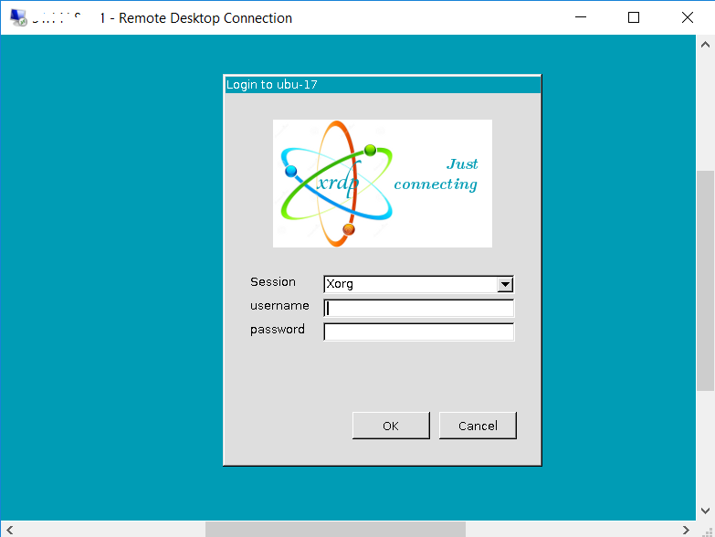

# Running .NET Core on Linux VM

- From the Azure portal, create a Linux VM with version of your choice; I chose Ubuntu 17
- Linux machines are usually managed from Command line via SSH, but we can create a desktop environment for it. 

## Install a desktop environment
- First, SSH to your VM via bash. 
In Azure portal, click on the *connect* button and it will give the *where* to SSH. For example, `ssh user-name@ip-add-re-ss`  
- Install the XFCE desktop environment using `apt` via commands
```
sudo apt-get update
sudo apt-get install xfce4
```
After the installation we have a desktop environment

## Install and configure a Remote Desktop Server 
- We now need to install Remote desktop server to listen to incoming connections
- `xrdp` is an open source RDP server which is available on most Linux distributions and works well with `xfce`. Install `xrdp` using: 
```
sudo apt-get install xrdp
```
- Now we need to tell `xrdp` which environment it should use when we start a session - in our case `xfce`. Configure xrdp to use xfce as your desktop environment as follows:
```
echo xfce4-session >~/.xsession
```
- Restart `xrdp` for the changes to take effect: `sudo service xrdp restart`

## Set up a local user account password
- If you have already setup password when you created the machine, then skip this step. Otherwise,
```
sudo passwd pass@word
```

## Create a Network Security Group rule for Remote Desktop traffic
- For the remote desktop traffic to reach our Linux VM, a network security rule needs to be created that allows TCP on RDP port 3389 to reach our VM. We can do this using the [Azure portal](https://docs.microsoft.com/en-us/azure/virtual-machines/windows/nsg-quickstart-portal?toc=%2fazure%2fvirtual-machines%2flinux%2ftoc.json) or via Azure Powershell command: 
```
az vm open-port --resource-group your-resource-group-name --name your-vm-name --port 3389
```
- If Azure CLI is not installed, it can be done via `sudo apt install azure-cli`
- There is **chance that the Azure CLI in Ubuntu is an older version**; to install the latest, please use [this instruction](https://docs.microsoft.com/en-us/cli/azure/install-azure-cli-apt?view=azure-cli-latest).

## RDP to your VM
- Choose the RDP client and connect to the IP address or DNS name, and enter username and password to connect.



## Installing and running dotnet core
- See instruction to [install dotnet core](https://www.microsoft.com/net/learn/get-started/linux/ubuntu17-10)
- After installation create a console app using `dotnet new console` in the *directory* of choice
- Build `dotnet build` and run `dotnet run`

### References
- [Use remote desktop in Ubuntu](https://docs.microsoft.com/en-us/azure/virtual-machines/linux/use-remote-desktop)
- [Install latest Azure CLI in Ubuntu](https://docs.microsoft.com/en-us/cli/azure/install-azure-cli-apt?view=azure-cli-latest)